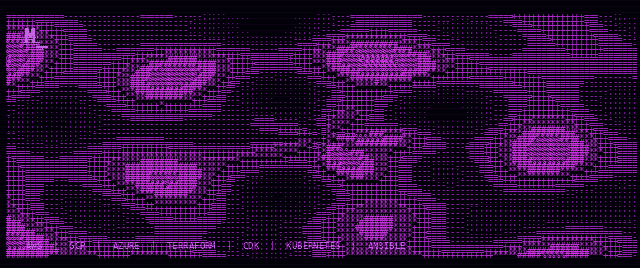
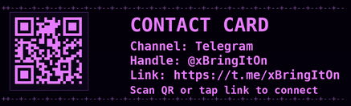

# MICHAEL G | SENIOR CLOUD ENGINEER

  

**Senior Cloud Engineer.** I build infrastructure that stays up, scales under load, and recovers without a war room. My wheelhouse is automation, reliability, and the platform layers people only notice when they break. I've shipped enough of this to know what I'm worth. Lately most of it is AI infrastructure: RAG with Pinecone, LangChain, and AWS Bedrock.

Backend engineer by background. Public experiments and side projects live on this GitHub. [Telegram @xBringItOn](https://t.me/xBringItOn) for collaboration.

## Certifications

  
  

## Tech Stack

  
  
  
  
  
  
  
  
  
  
  
  
  
  
  
  
  
  

## What I Build

- **Infrastructure as code** - AWS CDK, Terraform, repeatable idempotent provisioning
- **Cloud-native platforms** - EKS, Lambda, SageMaker, event-driven architectures on AWS
- **Kubernetes operations** - EKS design, autoscaling, VPC segmentation, workload reliability
- **DevOps automation** - GitHub Actions, ArgoCD, CodePipeline, modern release cycles
- **Production resilience** - CloudWatch, Prometheus, Grafana, IAM zero-trust, Route 53

## Contact

  

