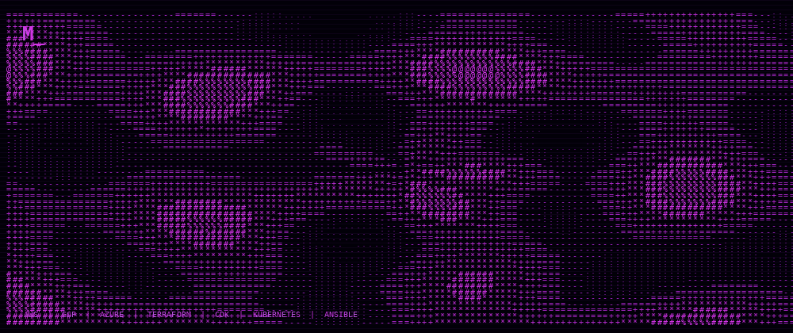
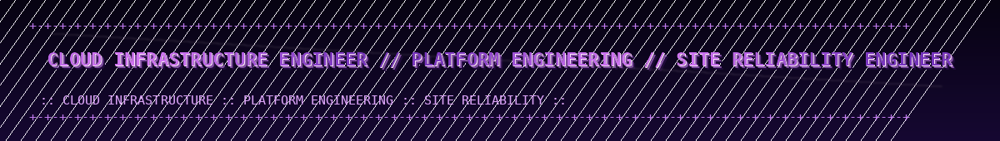

# MICHAEL G | SENIOR CLOUD ENGINEER

<p align="center">
  
</p>

<p align="center">
  
</p>

```text
[ STATUS: OPEN TO WORK ]  [ LOC: TORONTO ]  [ FOCUS: CLOUD PLATFORM + SRE ]
```

**Senior Cloud Engineer** building secure, scalable, highly available, disaster-recoverable systems. I work where infrastructure, automation, reliability, and developer experience meet. Currently building AI infrastructure (RAG with Pinecone, LangChain, AWS Bedrock).

Backend engineer by background. Public experiments and side projects live on this GitHub. [Telegram @xBringItOn](https://t.me/xBringItOn) for collaboration.

## Certifications

<p align="center">
  <a href="https://aws.amazon.com/certification/certified-solutions-architect-associate/">
    
  </a>
  <a href="https://aws.amazon.com/certification/certified-cloud-practitioner/">
    
  </a>
</p>

## Tech Stack

**Cloud**

<p align="center">
  
  
  
</p>

**Infrastructure as Code**

<p align="center">
  
  
  
  
</p>

**Runtime and Delivery**

<p align="center">
  
  
  
  
  
</p>

**Observability**

<p align="center">
  
  
  
</p>

**Languages and AI**

<p align="center">
  
  
  
</p>

## What I Build

```text
› infrastructure-as-code     AWS CDK, Terraform, repeatable idempotent provisioning
› cloud-native platforms     EKS, Lambda, SageMaker, event-driven architectures on AWS
› kubernetes operations      EKS design, autoscaling, VPC segmentation, workload reliability
› devops automation          GitHub Actions, ArgoCD, CodePipeline, modern release cycles
› production resilience      CloudWatch, Prometheus, Grafana, IAM zero-trust, Route 53
```

## Contact

<p align="center">
  <a href="https://t.me/xBringItOn">
    
  </a>
</p>
