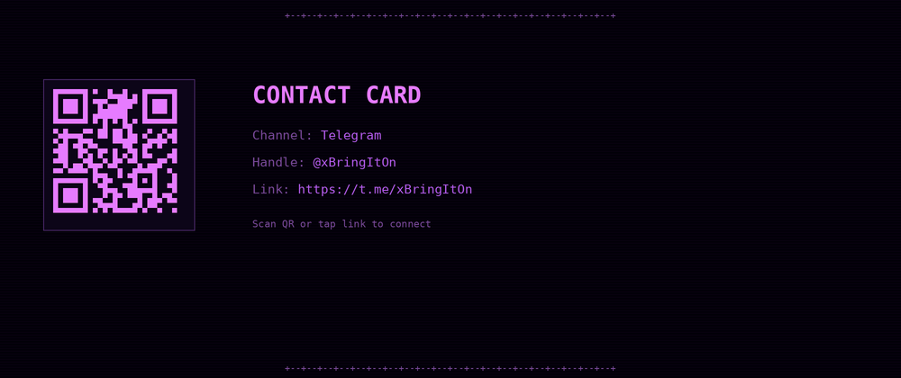

# MICHAEL G | SENIOR CLOUD ENGINEER

  

**Senior Cloud Engineer** building secure, scalable, highly available, disaster-recoverable systems. I work where infrastructure, automation, reliability, and developer experience meet. Currently building AI infrastructure (RAG with Pinecone, LangChain, AWS Bedrock).

Backend engineer by background. Public experiments and side projects live on this GitHub. [Telegram @xBringItOn](https://t.me/xBringItOn) for collaboration.

## Certifications

  
  

## Tech Stack

  
  
  
  
  
  
  
  
  
  
  
  
  
  
  
  
  
  

## What I Build

- **Infrastructure as code** - AWS CDK, Terraform, repeatable idempotent provisioning
- **Cloud-native platforms** - EKS, Lambda, SageMaker, event-driven architectures on AWS
- **Kubernetes operations** - EKS design, autoscaling, VPC segmentation, workload reliability
- **DevOps automation** - GitHub Actions, ArgoCD, CodePipeline, modern release cycles
- **Production resilience** - CloudWatch, Prometheus, Grafana, IAM zero-trust, Route 53

## Contact

  

